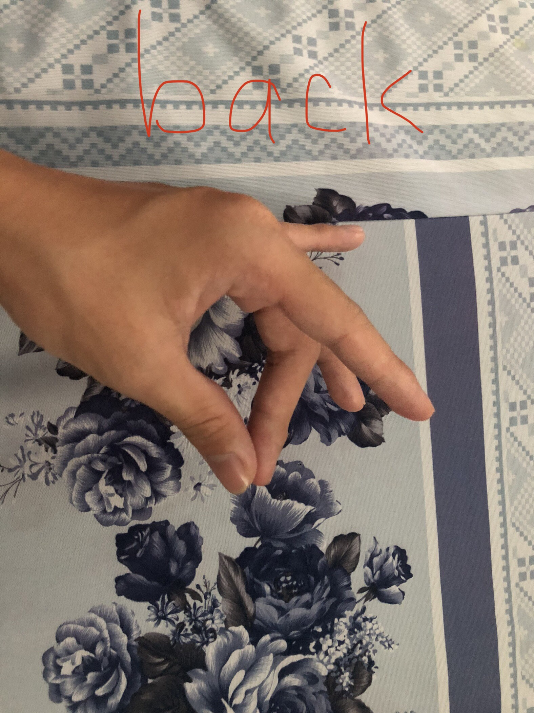
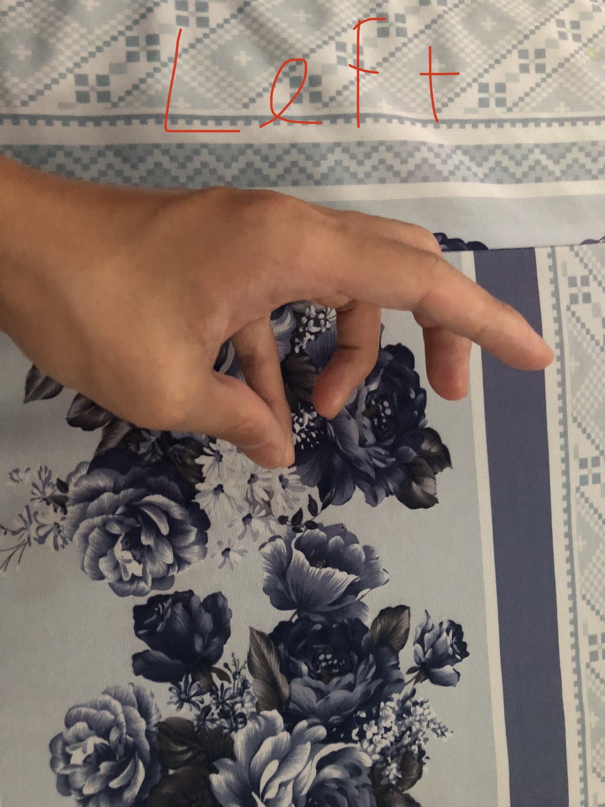

<h2> How TO USE</h2>

pip install requirements.txt

this is a 2 program . 

If u want to play 2 file python, use 2songsong.python

<h2> How TO PLAY</h2>

Front: thumb touches index finger

Back: thumb touches middle finger

Right: thumb touches ring finger

Left: thumb touches little finger (or pinky)

That's all